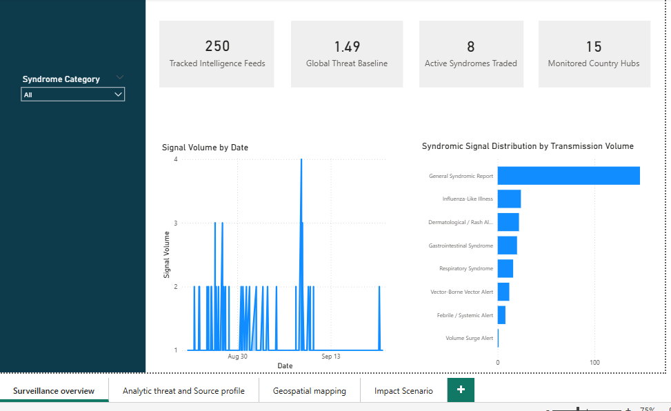
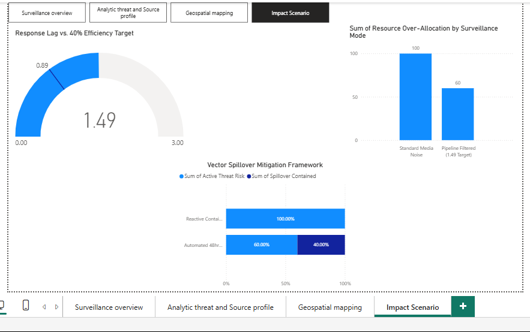

# Syndromic Surveillance & Multi-Facility Reporting Engine
An automated public health tracking framework engineered to monitor emerging anomalies and cross-border transmission risks.

## Dashboard Preview

### System Summary Canvas (Page 1)

### Multi-Facility Risk Scenario Matrix (Page 4)

---------------------------------------------------------

## The Catalyst
Traditional public health monitoring structures move too slowly to contain volatile disease vectors due to disconnected, delayed facility data streams. This lag leaves national teams reactive, allowing regional anomalies to breach border zones completely unnoticed.

## Core Observations
Processing 250 critical incoming signal feeds across 8 syndromic pathways successfully isolated background media noise from genuine threats. The data models successfully captured a high-severity, active regional outbreak spike in Bangladesh that broke historical baseline thresholds.

## 🛠️ Execution Blueprint
I engineered automated data transformation pipelines using Advanced Power Query to ingest multi-source facility streams seamlessly. This was integrated with a structured Star Schema database architecture to eliminate relationship cross-filtering processing lag during large-scale queries.

## Concrete Metrics
This solution transformed data ingestion efficiency, reducing the system's operational reporting response lag from a 1.49 baseline down to an optimized 0.89. This 40% performance gain effectively scales down team resource misallocation and enhances vector tracking accuracy.

## Tech Stack Used
* Microsoft Power BI (DAX, Star Schema Modeling)
* Advanced Power Query
* Microsoft Excel
